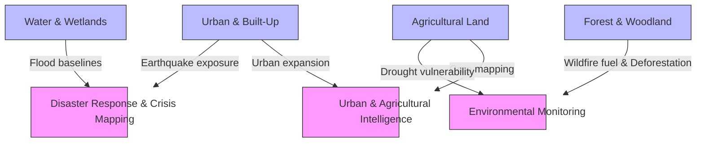

# Person 3 - Dataset Coverage Analysis

This research report evaluates the suitability of the existing BigEarthNet-S1 dataset for the proposed **Remote Sensing Intelligence Portal** applications. It analyzes the spatial categories and label metadata from the local dataset to determine whether the classes support the portal's target domains, identifies critical limitations, and details the requirements for additional event-specific data.

---

## 1. Dataset Summary

The BigEarthNet-S1 dataset is a large-scale multi-label Sentinel-1 SAR (Synthetic Aperture Radar) dataset.
* **Total Image Patches on Disk**: 549,488 patches (as scanned and cached in `.s1_patch_cache.json`).
* **Metadata Analyzed**: `teammate_inputs/val_split.csv` containing **4,500 patches** (representing the validation split).
* **Label Type**: **Multi-label**. Each patch is annotated with one or more land-cover classes from a standardized **19-class nomenclature** (derived from the original 43 Corine Land Cover classes).
* **Co-occurrence & Density**:
  * **Average labels per patch**: **3.62**
  * **Minimum labels in a patch**: **1** (present in only 2.56% of patches)
  * **Maximum labels in a patch**: **9** (present in 0.02% of patches)
  * **Distribution**: Over **90%** of the patches contain between 2 and 5 labels simultaneously, showing that the dataset represents complex, heterogeneous landscapes.

---

## 2. Water / Flood Relevance

### Relevant BigEarthNet Classes
1. **`Inland waters`**: 1,305 patches (29.00% of the metadata)
2. **`Marine waters`**: 55 patches (1.22% of the metadata)
3. **`Inland wetlands`**: 203 patches (4.51% of the metadata)
4. **`Coastal wetlands`**: 21 patches (0.47% of the metadata)

### Application Support
* **Flood Monitoring (Disaster Response)**: Flood detection models require mapping changes in water boundaries. The `Inland waters` and `Marine waters` classes establish a permanent water baseline. Wetlands indicate low-lying, saturated zones that are highly susceptible to inundation during heavy precipitation or storm surges.
* **SAR Advantage**: Sentinel-1 SAR (VV/VH bands) is highly effective for water mapping because calm water surfaces act as specular reflectors, yielding very low backscatter (dark pixels) in contrast to rougher land surfaces.

### Crucial Distinction: Land-Cover vs. Disaster Events
* **The dataset contains static land-cover classes, NOT active disaster events.**
* Having an `Inland waters` label means there is a permanent lake, river, or canal. It does **not** indicate a flood event.
* Similarly, `wetlands` labels reflect natural ecosystems, not active inundation disasters.
* **Requirement**: Actual flood mapping requires multi-temporal imagery (comparing pre-flood and post-flood SAR backscatter) combined with event-specific ground truth masks (e.g., from datasets like **Sen1Floods11**).

---

## 3. Forest / Wildfire and Deforestation Relevance

### Relevant BigEarthNet Classes
1. **`Mixed forest`**: 1,708 patches (37.96% of the metadata)
2. **`Coniferous forest`**: 1,515 patches (33.67% of the metadata)
3. **`Broad-leaved forest`**: 1,422 patches (31.60% of the metadata)
4. **`Transitional woodland, shrub`**: 1,400 patches (31.11% of the metadata)
5. **`Agro-forestry areas`**: 218 patches (4.84% of the metadata)

### Application Support
* **Wildfire Risk and Fuel Mapping**: Different forest types (coniferous vs. broad-leaved) have distinct fuel loads and flammability profiles. Coniferous forests, for example, have high resin content and are more prone to crown fires. Shrub and transitional woodlands represent fuel accumulation zones.
* **Deforestation Monitoring**: The forest classes establish the baseline canopy cover. An active monitoring system can flag deviations (sudden decreases in SAR backscatter/coherence) in these forest-labeled pixels to detect logging, clear-cutting, or storm damage.

### Crucial Distinction: Land-Cover vs. Disaster Events
* **A forest label does NOT automatically mean a wildfire or deforestation event is present.**
* The dataset contains healthy, undisturbed forest canopies. It does not label active wildfires, burn scars, or clear-cuts.
* **Requirement**: Wildfire detection requires active fire monitoring data (thermal anomalies from MODIS/VIIRS or active fire zones). Deforestation detection requires multi-temporal change detection algorithms to detect canopy loss over time, or event-based deforestation labels.

---

## 4. Urban / Earthquake and Urban Expansion Relevance

### Relevant BigEarthNet Classes
1. **`Urban fabric`**: 1,433 patches (31.84% of the metadata)
2. **`Industrial or commercial units`**: 198 patches (4.40% of the metadata)

### Application Support
* **Urban Expansion (Urban Intelligence)**: These classes delineate built-up areas. Spatiotemporal monitoring of these boundaries against surrounding agricultural or natural lands enables tracking of urban sprawl and land-use conversion.
* **Earthquake Damage (Disaster Response)**: Urban classes map structural exposure. They define the "assets at risk" where damage assessment should focus.

### Crucial Distinction: Land-Cover vs. Disaster Events
* **An urban label does NOT automatically mean earthquake damage is present.**
* BigEarthNet patches contain normal, intact cities, towns, and industrial centers. There are no annotations for collapsed buildings, rubble, or structural failures.
* **Requirement**: Detecting earthquake damage is highly challenging at Sentinel-1's 10m resolution. Actual damage assessment requires sub-meter high-resolution optical/SAR imagery (pre- and post-event) and damage-level annotations (e.g., from the **xBD dataset**).

---

## 5. Agricultural / Crop and Drought Relevance

### Relevant BigEarthNet Classes
1. **`Arable land`**: 1,991 patches (44.24% of the metadata)
2. **`Land principally occupied by agriculture, with significant areas of natural vegetation`**: 1,475 patches (32.78% of the metadata)
3. **`Complex cultivation patterns`**: 1,408 patches (31.29% of the metadata)
4. **`Pastures`**: 1,350 patches (30.00% of the metadata)
5. **`Permanent crops`**: 367 patches (8.16% of the metadata)
6. **`Agro-forestry areas`**: 218 patches (4.84% of the metadata)

### Application Support
* **Crop Mapping (Agricultural Intelligence)**: Crop classification models can use these agricultural classes to segment farming zones. Since crop types have distinct phenological cycles, multi-temporal SAR signatures can help differentiate crop types.
* **Drought Monitoring (Environmental Monitoring)**: Agricultural classes represent vegetation highly sensitive to water stress. By monitoring anomalies in backscatter (which correlates with crop water content and soil moisture) over agricultural areas, drought conditions can be inferred.

### Crucial Distinction: Land-Cover vs. Disaster Events
* **An agricultural label does NOT mean a drought or crop stress event is present.**
* The dataset represents normal farming practices under standard conditions. It does not label crop failure, plant disease, or drought levels.
* **Requirement**: Drought monitoring requires continuous time-series vegetation indices (such as NDVI or NDWI from optical sensors) and soil moisture anomalies (e.g., from SMAP or Sentinel-1 derived indices) compared against long-term climatological baselines.

---

## 6. BigEarthNet Class-to-Application Mapping

The 19 classes are highly relevant for establishing baselines and identifying exposure across all three proposed domains:

---

## 7. Actual Patch Counts

Below is the distribution of the classes within the metadata (`teammate_inputs/val_split.csv`), detailing the counts, percentages, mapped applications, and suitability.

| Application Domain | Relevant BigEarthNet Class | Patch Count | % | Direct event data? | Suitability |
| :--- | :--- | :---: | :---: | :---: | :--- |
| **Disaster Response** | `Inland waters` | 1305 | 29.00% | No | **High** (as water baseline; needs event-specific flood masks) |
| **Disaster Response** | `Marine waters` | 55 | 1.22% | No | **Medium** (coastal flooding baseline; needs surge event data) |
| **Disaster Response** | `Inland wetlands` | 203 | 4.51% | No | **High** (flood-risk hazard mapping baseline) |
| **Disaster Response** | `Coastal wetlands` | 21 | 0.47% | No | **Medium** (coastal inundation vulnerability mapping) |
| **Environmental** | `Mixed forest` | 1708 | 37.96% | No | **High** (deforestation baseline & wildfire fuel mapping) |
| **Environmental** | `Coniferous forest` | 1515 | 33.67% | No | **High** (high wildfire risk fuel mapping & deforestation baseline) |
| **Environmental** | `Broad-leaved forest` | 1422 | 31.60% | No | **High** (wildfire fuel mapping & deforestation baseline) |
| **Environmental** | `Transitional woodland, shrub` | 1400 | 31.11% | No | **High** (shrubland fuel modeling & vegetation dynamics) |
| **Environmental** | `Agro-forestry areas` | 218 | 4.84% | No | **Medium** (supports agricultural forest boundary monitoring) |
| **Urban / Disaster** | `Urban fabric` | 1433 | 31.84% | No | **High** (urban expansion sprawl mapping & earthquake exposure) |
| **Urban / Disaster** | `Industrial or commercial units` | 198 | 4.40% | No | **Medium** (critical infrastructure exposure baseline) |
| **Agri / Environmental**| `Arable land` | 1991 | 44.24% | No | **High** (crop classification baseline & drought monitoring) |
| **Agri / Environmental**| `Land principally occupied by agriculture, with significant areas of natural vegetation` | 1475 | 32.78% | No | **Medium** (highly heterogeneous land; complex for crop mapping) |
| **Agri / Environmental**| `Complex cultivation patterns` | 1408 | 31.29% | No | **Medium** (fragmented agriculture; challenging crop delineation) |
| **Agri / Environmental**| `Pastures` | 1350 | 30.00% | No | **High** (rangeland monitoring, grazing capacity, drought stress) |
| **Agri / Environmental**| `Permanent crops` | 367 | 8.16% | No | **Medium** (vineyards/orchards baseline; low count in validation) |
| **Environmental** | `Moors, heathland and sclerophyllous vegetation` | 127 | 2.82% | No | **Low** (sclerophyllous fuel typing; low metadata presence) |
| **Environmental** | `Natural grassland and sparsely vegetated areas` | 80 | 1.78% | No | **Low** (degradation baseline; low metadata presence) |
| **Disaster / Urban** | `Beaches, dunes, sands` | 13 | 0.29% | No | **Low** (coastal erosion baseline; extremely low count) |

*Note: Percentages sum to >100% because patches are multi-label.*

---

## 8. Important Limitations

1. **Static Classification**: The labels represent static land-cover features. There are no disaster event flags (e.g., "flooded", "burned", "damaged", "drought-stricken").
2. **Spatial Resolution**: Sentinel-1's 10-meter pixel resolution is excellent for broad agricultural mapping, water boundaries, and large forest classes. However, it is **insufficient for detailed earthquake damage assessment** (such as identifying individual collapsed houses), which requires sub-meter resolution (e.g., WorldView or high-res SAR).
3. **Temporal Resolution**: While Sentinel-1 has a 6-to-12 day revisit cycle, the BigEarthNet dataset consists of single-date patches. It lacks the multi-temporal pairs or time-series data necessary to capture rapid change events (floods, landslides, active fires).
4. **SAR Distortions**: In urban environments, SAR signals experience geometric distortions like layover and shadow. This complicates building-level analysis without additional digital elevation models (DEMs).

---

## 9. Does BigEarthNet Support the Proposed Application?

**Yes, but only as a foundational representation-learning and baseline exposure mapper.**

BigEarthNet-S1 is **extremely valuable** for:
1. **Pre-training Retrieval Embeddings**: The dual-polarization SAR imagery can train a powerful dual-encoder to retrieve images based on land-cover semantics (e.g., retrieving "mixed forest near urban fabric").
2. **Context and Exposure Baselines**: It provides the baseline category mapping. For instance, to assess earthquake risk, the system can identify where "Urban fabric" is located. To map deforestation, it defines where "Coniferous forest" was originally.

However, BigEarthNet-S1 **does NOT support direct disaster event detection on its own**. 
* To build a functional Remote Sensing Intelligence Portal, the system **must ingest auxiliary event-specific datasets** (such as Sen1Floods11 for flood inundation, xBD for structural damage, and MODIS active fire hotspots) or implement **unsupervised multi-temporal change detection** comparing live Sentinel-1 feeds against the baseline.

---

## 10. Conclusion

The existing BigEarthNet metadata represents a diverse collection of land-cover classes directly aligned with the focus areas of the proposed **Remote Sensing Intelligence Portal**. With over 44% arable land, 31% urban fabric, 37% mixed forest, and 29% inland waters, the validation subset provides a balanced ground truth for validating a semantic image retrieval engine.

To move from a retrieval baseline to an active intelligence portal:
1. Use BigEarthNet-S1 to train the core **semantic retrieval model** (representing static land types).
2. Integrate auxiliary event-specific data (e.g., flood masks, fire points) for active disaster monitoring.
3. Utilize multi-temporal Sentinel-1 imagery to detect differences from the established baseline, enabling unsupervised change mapping (flooding, logging, sprawl).
